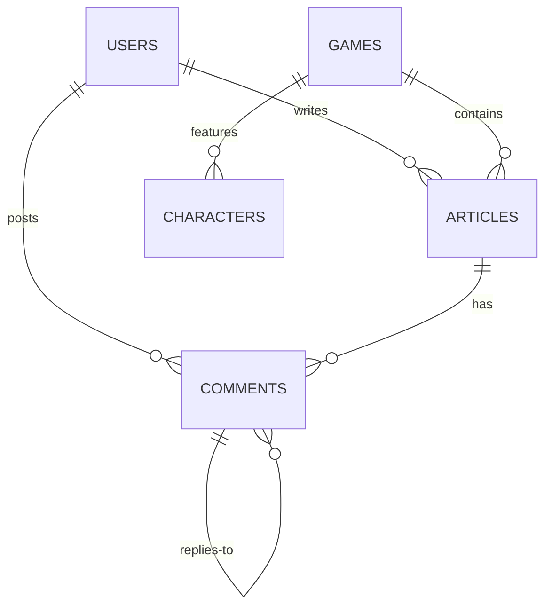

# Game Guide Platform - 数据库可视化

## 数据库概览

- **数据库类型**: SQLite
- **数据库文件**: `backend/game_guide.db`
- **表数量**: 5

---

## ER 关系图



---

## 表结构详情

### 1. users (用户表)

| 字段 | 类型 | 约束 | 说明 |
|------|------|------|------|
| id | INTEGER | PK | 用户ID |
| username | VARCHAR(50) | UNIQUE | 用户名 |
| email | VARCHAR(100) | UNIQUE | 邮箱 |
| hashed_password | VARCHAR(255) | NOT NULL | 加密密码 |
| avatar | VARCHAR(500) | | 头像URL |
| bio | TEXT | | 个人简介 |
| is_active | BOOLEAN | | 是否激活 |
| is_admin | BOOLEAN | | 是否管理员 |
| is_verified | BOOLEAN | | 邮箱已验证 |
| verification_code | VARCHAR(6) | | 验证码 |
| verification_expires | DATETIME | | 验证码过期时间 |
| created_at | DATETIME | | 注册时间 |

### 2. games (游戏表)

| 字段 | 类型 | 约束 | 说明 |
|------|------|------|------|
| id | INTEGER | PK | 游戏ID |
| name | VARCHAR(100) | UNIQUE | 游戏名称 |
| slug | VARCHAR(100) | UNIQUE | URL别名 |
| cover_image | VARCHAR(500) | | 封面图 |
| description | TEXT | | 游戏描述 |
| category | VARCHAR(50) | | 游戏分类 |
| release_date | DATETIME | | 发售日期 |
| developer | VARCHAR(100) | | 开发商 |
| publisher | VARCHAR(100) | | 发行商 |
| created_at | DATETIME | | 创建时间 |

### 3. characters (角色表)

| 字段 | 类型 | 约束 | 说明 |
|------|------|------|------|
| id | INTEGER | PK | 角色ID |
| game_id | INTEGER | FK | 所属游戏 |
| name | VARCHAR(100) | | 角色名 |
| rarity | VARCHAR(20) | | 稀有度 |
| element | VARCHAR(30) | | 元素属性 |
| weapon_type | VARCHAR(30) | | 武器类型 |
| description | TEXT | | 角色描述 |
| image | VARCHAR(500) | | 角色图片 |
| created_at | DATETIME | | 创建时间 |

### 4. articles (文章表)

| 字段 | 类型 | 约束 | 说明 |
|------|------|------|------|
| id | INTEGER | PK | 文章ID |
| title | VARCHAR(200) | | 标题 |
| slug | VARCHAR(200) | UNIQUE | URL别名 |
| content | TEXT | | 文章内容 |
| cover_image | VARCHAR(500) | | 封面图 |
| game_id | INTEGER | FK | 关联游戏 |
| author_id | INTEGER | FK | 作者 |
| category | VARCHAR(50) | | 分类 |
| tags | VARCHAR(200) | | 标签 |
| views | INTEGER | | 阅读量 |
| likes | INTEGER | | 点赞数 |
| is_published | BOOLEAN | | 是否发布 |
| created_at | DATETIME | | 创建时间 |
| updated_at | DATETIME | | 更新时间 |

### 5. comments (评论表)

| 字段 | 类型 | 约束 | 说明 |
|------|------|------|------|
| id | INTEGER | PK | 评论ID |
| content | TEXT | | 评论内容 |
| article_id | INTEGER | FK | 所属文章 |
| author_id | INTEGER | FK | 评论者 |
| parent_id | INTEGER | FK | 父评论(回复) |
| likes | INTEGER | | 点赞数 |
| created_at | DATETIME | | 创建时间 |

---

## 表关系图

```
┌─────────────┐       ┌─────────────┐       ┌─────────────┐
│   USERS     │       │   GAMES     │       │  ARTICLES   │
├─────────────┤       ├─────────────┤       ├─────────────┤
│ 🔑 id       │       │ 🔑 id       │       │ 🔑 id       │
│   username  │       │   name      │       │   title     │
│   email     │       │   slug      │       │   content   │
│   password  │       │   cover     │       │   slug      │
└──────┬──────┘       └──────┬──────┘       │   game_id ──┼──────┐
       │                     │              │   author_id ─┼────┐│
       │ 1:N                 │ 1:N          └─────────────┘   ││
       ├─────────────────────┼─────────────────────────────>   ││
       │                     │                                 ││
       ▼                     ▼                                 ││
┌─────────────┐       ┌─────────────┐                          │
│  COMMENTS   │       │ CHARACTERS  │                          │
├─────────────┤       ├─────────────┤                          │
│ 🔑 id       │       │ 🔑 id       │                          │
│   content   │       │   name      │                          │
│   article_id ──────>│   game_id ──┘                          │
│   author_id ────────┘                                        │
│   parent_id ──> (自关联)                                      │
└─────────────┘
```

---

## 快速查看数据

```bash
# 查看所有表
cd backend
python db_schema.py

# 使用 sqlite3 命令行
sqlite3 game_guide.db
.schema
SELECT * FROM users;
```

---

## 可视化工具推荐

1. **DBeaver** (免费) - 支持 SQLite
2. **DB Browser for SQLite** - 轻量级 SQLite 管理器
3. **VSCode SQLite 扩展** - 直接在编辑器查看

